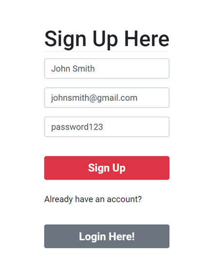

# Car Hacks :red_car:	


    


  ## Table of Contents
  - [Description](#description)
  - [User Story](#userstory)
  - [Acceptance Criteria](#acceptancecriteria)
  - [Installation](#installation)
  - [Usage](#usage)
  - [License](#license)
  - [Contributing](#contributing)
  - [Tests](#tests)


## Description:

  [Deployed Link: xx.herokuapp.com/](xx.herokuapp.com/)

Car Hacks is a MERN application that allows 
=======
Deployed Link: [https://carhacks.herokuapp.com/]

A car can take you to places and saves time. Whether you are in the market of buying, maintaining, modifying, and selling your car, the process can be overwhelming. We're here to help. Car Hacks is an app that can help you in the journey with a tap of a button. This app links to millions of websites out there to search on. Our app is aimed to streamline the process by gathering all the best available resources. You do not have to deal with car salesman while getting the know what best deal for you.

<a name="userstory"></a>
## User Story

```md
AS A User
I WANT a car app
SO THAT I can buy, maintain, modify, and sell your car with a tap of a 
button while being to explore all the different options out there.
```
<a name="acceptancecriteria"></a>
## Acceptance Criteria

```md
This project required:
- Must use ReactJS in some way (even if minimal)
- Must use a Node and Express Web Server
- Must be backed by a MySQL or MongoDB Database with a Sequelize or Mongoose ORM 
- Must have both GET and POST routes for retrieving and adding new data
- Must be deployed using Heroku (with Data)
- Must utilize at least two libraries, packages, or technologies that we haven’t discussed
- Must allow for or involve the authentication of users in some way
- Must have a polished frontend/UI
- Must have folder structure that meets MVC Paradigm
- Must meet good quality coding standards (indentation, scoping, naming)
- Must not expose sensitive API key information on the server
```
 
  ## Installation:
```text
npm init 
npm run
npm start
npm eslint
```


  ## License(s) Used:
  -  

  ## Contributing:

| Roseanne Nguyen  | [:octocat: roseannenguyen](https://github.com/roseannenguyen)|
| Josh Malone  | [:octocat: jmalone506](https://github.com/jmalone506)|
| Alicia Qiu  | [:octocat: aliciaqiu27](https://github.com/aliciaqiu27)|
| Jammie Hardy  | [:octocat: jamehardy2](https://github.com/jamehardy2)|


  ## Test:



  ## References:


