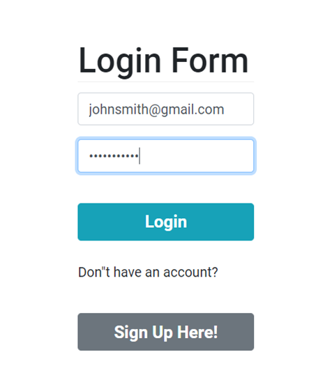

# Car Hacks :red_car:


  

## Table of Contents
=======
    

  

    


- [Description](#description)
- [User Story](#userstory)
- [Acceptance Criteria](#acceptancecriteria)
- [Technologies](#technologies)
- [Installation](#installation)
- [Usage](#usage)
- [License](#License)
- [Contributing](#contributing)
- [Tests](#tests)
- [Credits](#credits)
- [References](#references)


## Description:
Deployed Link: [https://carhacks.herokuapp.com/]

A car is essential to in everyone's life. It can conveniently take you to place and help you save time. Whether you are in the market of buying, maintaining, modifying, and selling your car, the process can be overwhelming. Car Hacks is here to help! This app can help you through this journey with a tap of a button. The Car Hacks app links to millions of websites out there to gather all the best available resources.


<a name="userstory"></a>
## User Story

```md
AS A User
I WANT a car app
SO THAT I can buy, maintain, modify, and sell your car with a tap of a
button while being to explore all the different options out there.
```

<a name="acceptancecriteria"></a>

## Acceptance Criteria

```md
This project required:

- Must use ReactJS in some way (even if minimal)
- Must use a Node and Express Web Server
- Must be backed by a MySQL or MongoDB Database with a Sequelize or Mongoose ORM
- Must have both GET and POST routes for retrieving and adding new data
- Must be deployed using Heroku (with Data)
- Must utilize at least two libraries, packages, or technologies that we haven’t discussed
- Must allow for or involve the authentication of users in some way
- Must have a polished frontend/UI
- Must have folder structure that meets MVC Paradigm
- Must meet good quality coding standards (indentation, scoping, naming)
- Must not expose sensitive API key information on the server
```


## Technologies:
MongoDB \
Mongoose \
React \
Anxios \
Asana \
sweetalert2-react \
react-quotes-rotator

## Installation:

```text
npm init
npm run
npm start
npm run build
npm i react-quotes-rotator
npm i sweetalert2-react
npm eslint
```


## License:


MIT License
Copyright (c) [2021]
Permission is hereby granted, free of charge, to any person obtaining a copy of this software and associated documentation files (the "Software"), to deal in the Software without restriction, including without limitation the rights to use, copy, modify, merge, publish, distribute, sublicense, and/or sell copies of the Software, and to permit persons to whom the Software is furnished to do so, subject to the following conditions:

The above copyright notice and this permission notice shall be included in all copies or substantial portions of the Software.

THE SOFTWARE IS PROVIDED "AS IS", WITHOUT WARRANTY OF ANY KIND, EXPRESS OR IMPLIED, INCLUDING BUT NOT LIMITED TO THE WARRANTIES OF MERCHANTABILITY, FITNESS FOR A PARTICULAR PURPOSE AND NONINFRINGEMENT. IN NO EVENT SHALL THE AUTHORS OR COPYRIGHT HOLDERS BE LIABLE FOR ANY CLAIM, DAMAGES OR OTHER LIABILITY, WHETHER IN AN ACTION OF CONTRACT, TORT OR OTHERWISE, ARISING FROM, OUT OF OR IN CONNECTION WITH THE SOFTWARE OR THE USE OR OTHER DEALINGS IN THE SOFTWARE.

## Contributing:

| Roseanne Nguyen | [:octocat: roseannenguyen](https://github.com/roseannenguyen)| \
| Josh Malone | [:octocat: jmalone506](https://github.com/jmalone506)| \
| Alicia Qiu | [:octocat: aliciaqiu27](https://github.com/aliciaqiu27)| \
| Jammie Hardy | [:octocat: jamehardy2](https://github.com/jamehardy2)|

## Test:




## Credits:

Car Hacks is a MERN application for the final project at the University of Arizona.

## References:

https://react-bootstrap.github.io/ \
https://www.mongodb.com/cloud/atlas/ \
https://asana.com/ \
https://therichpost.com/how-to-open-sweetalert-popup-on-button-click-in-reactjs/ \
https://www.npmjs.com/package/react-quotes-rotator/v/1.0.0?activeTab=readme/